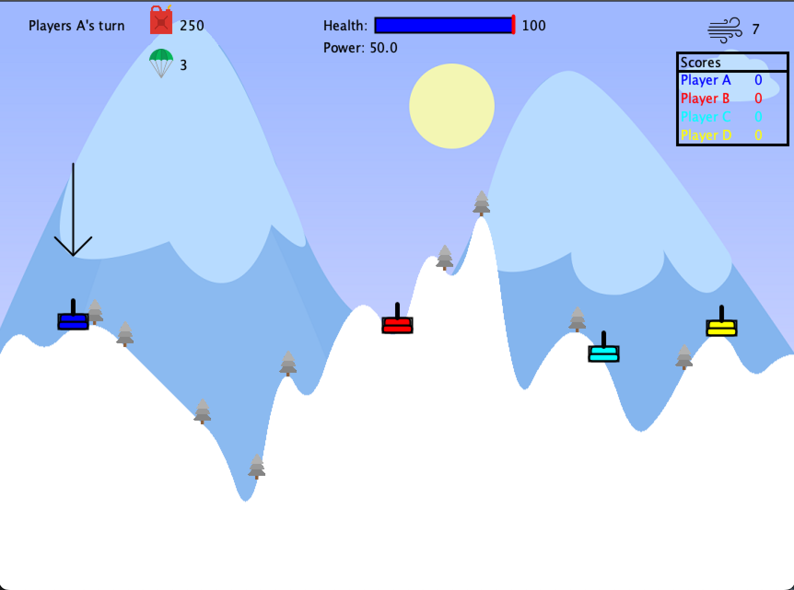

# Tanks

 This game was created in Java using the processing library for graphics and gradle as a dependency manager. In the game, players control tanks which can aim and fire at each other. Players gain score for hitting another player’s tank, causing them to lose health. After all levels are completed, the player with the highest score wins.

The game has three levels with different terrain, the players use the following controls to play the game 

<ul>
<li> <strong> Left arrow</strong> : To move the tank left </li>
<li> <strong> Right arrow</strong> : To move the tank right </li>
<li> <strong> Up arrow</strong> : To move the tanks turret left</li>
<li> <strong> Down arrow</strong> : To move the tanks turret right</li>
<li> <strong> Space</strong> : To fire</li>
<li> <strong> W</strong> : To increase cannon power</li>
<li> <strong> S</strong> : To decrease cannon power</li>
<li> <strong> R</strong> : To reset the game once over</li>
</ul>

# Installation

To run the game, you will need to install:

<ul>
<li>Java 8</li>
<li>Gradle</li>
</ul>

# Running game

To build the game: `gradle build`

To run the game: `gradle run`

